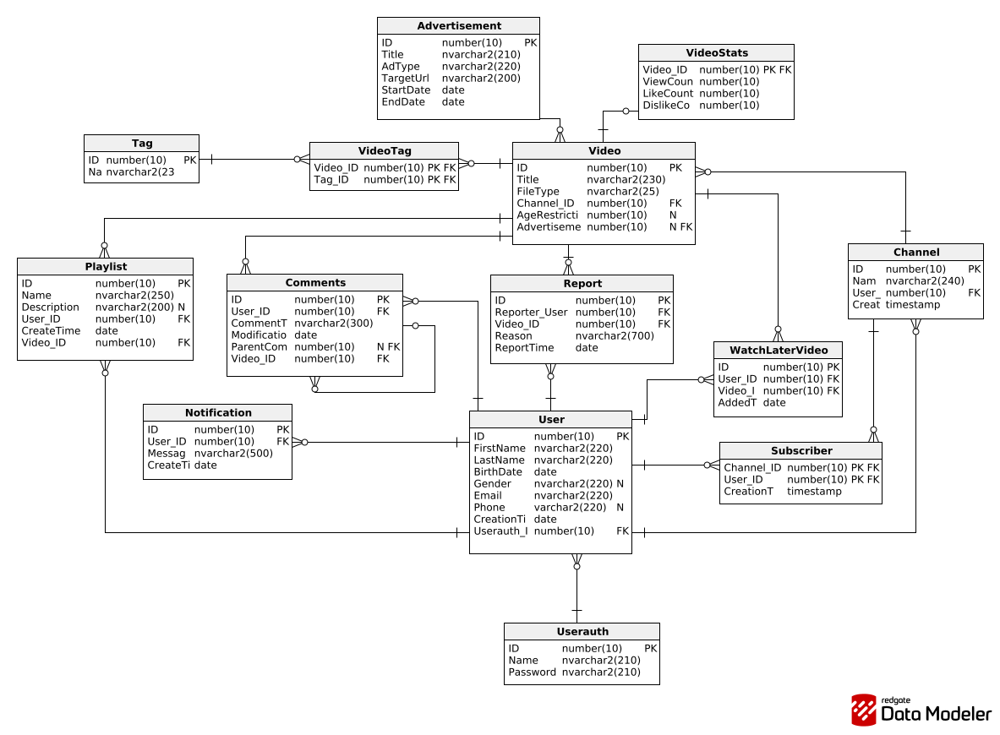

# Video Platform Database Project

A relational database project that models the core functionality of a video-sharing platform similar to YouTube.

The project was prepared as a university database assignment and includes database design, schema creation, sample data, stored procedures, triggers, and test scripts for **Microsoft SQL Server** and **Oracle**.

## Project overview

The database supports the following areas:

- user accounts and authentication
- channels and subscribers
- videos and video statistics
- tags and video-tag relationships
- playlists
- watch later list
- comments with parent-child replies
- notifications
- reports
- advertisements

## Main features

- **Relational schema design** with primary keys, foreign keys, unique constraints, and check constraints
- **Cross-platform implementation** for:
  - Microsoft SQL Server
  - Oracle Database
- **Sample data** for testing and demonstration
- **Stored procedures** implementing business logic
- **Triggers** for automatic validation and related actions
- **Test scripts** showing example usage of procedures and triggers

## ER diagram



## Database objects

The project contains 14 main tables:

1. Advertisement
2. Userauth
3. Users / "User"
4. Channel
5. Video
6. VideoStats
7. Tag
8. VideoTag
9. Subscriber
10. Playlist
11. WatchLaterVideo
12. Comments
13. Notification
14. Report

### Implemented procedures

#### 1. `publish_video_and_notify`
Adds a new video and sends notifications to all subscribers of the channel.

#### 2. `subscribe_user`
Creates a new subscription with validation and notifies the channel owner.

### Implemented triggers

#### 1. `tr_video_create_stats`
Automatically creates a `VideoStats` row with zero counters after a new video is inserted.

#### 2. `tr_ad_validate_dates`
Validates advertisement dates, allowed advertisement types, and URL format during insert/update operations.

## Repository structure

```text
DDL_MsSQL.sql
DDL_Oracle.sql
DML_MsSQL.sql
DML_Oracle.sql
MsSQL_Trigger_Procedure.sql
Oracle_Trigger_Procedure.sql
Test_MsSQL.sql
Test_Oracle.sql
SBD_Project_Try1-2026-01-09_23-54.png
README.md
```

## How to run the project

### Microsoft SQL Server

Run the files in this order:

1. `DDL_MsSQL.sql`
2. `DML_MsSQL.sql`
3. `MsSQL_Trigger_Procedure.sql`
4. `Test_MsSQL.sql`

**Important:**

The SQL Server DML, procedure, and test scripts use the schema name `s32782`.
If your environment uses a different schema, either:

- change `s32782` to your schema name in the scripts, or
- configure your SQL Server user/schema accordingly before running the files.

### Oracle Database

Run the files in this order:

1. `DDL_Oracle.sql`
2. `DML_Oracle.sql`
3. `Oracle_Trigger_Procedure.sql`
4. `Test_Oracle.sql`

**Important:**

- The Oracle version uses the table name `"User"` because `USER` is a reserved word.
- For test output in Oracle SQL Developer / SQL*Plus, enable:

```sql
SET SERVEROUTPUT ON;
```

## Example business rules implemented

- advertisement end date cannot be earlier than start date
- advertisement type must be one of: `pre-roll`, `overlay`, `banner`
- advertisement URL must start with `http://` or `https://`
- age restriction cannot be negative
- a user cannot subscribe to their own channel
- duplicate subscriptions are not allowed
- a `VideoStats` record is created automatically for every new video

## Sample data

The scripts include sample data for:

- 10 users
- 5 channels
- 10 videos
- 10 tags
- subscribers, playlists, comments, reports, notifications, and advertisements

This makes it possible to test relations, procedures, and triggers immediately after setup.

## Technologies used

- SQL
- T-SQL
- PL/SQL
- Microsoft SQL Server
- Oracle Database
- relational database modeling

## Notes

This project was created for educational purposes to demonstrate database design and database programming concepts in two different SQL environments.

## Author

**Irina Nekrashevych**
